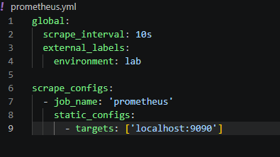
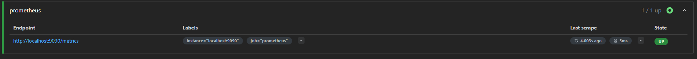
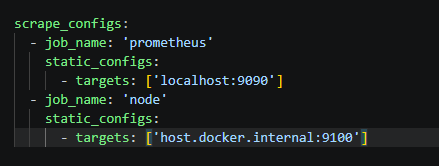
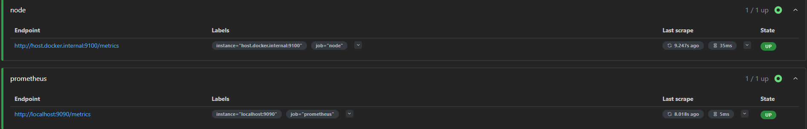
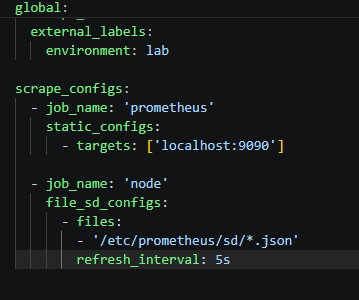

# Observabilité avec Prometheus, Grafana et Thanos
## Exo1
### 1. Récupérer l'image : docker pull prom/prometheus:latest
    ```bash
    docker pull prom/prometheus:latest
    ```
### 2. La lancer : docker run -d --name prometheus -p 9090:9090 prom/prometheus:latest
    ```bash
    docker run -d --name prometheus -p 9090:9090 prom/prometheus:latest
    ```
### 3. Ouvrir http://localhost:9090 dans votre navigateur
       
### 4. Aller dans Status > Targets et confirmer que la cible prometheus est UP
       
### 5. on verifie les logs :
    ```bash
    docker logs  prometheus
    ```


## Exo2	
### 6. Arrêter le conteneur précédent : docker rm -f prometheus

### 7. Créer un fichier prometheus.yml sur l'hôte avec les paramètres demandés

### 8. Lancer un nouveau conteneur avec --web.enable-lifecycle et le fichier monté sur /etc/prometheus/prometheus.yml
```bash
docker run -d --name prometheus -p 9090:9090 -v "${PWD}/prometheus.yml:/etc/prometheus/prometheus.yml" prom/prometheus:latest --config.file=/etc/prometheus/prometheus.yml --web.enable-lifecycle
```
### 9. Modifier le fichier puis déclencher un rechargement : curl -X POST http://localhost:9090/-/reload

### 10. Confirmer la modification dans Status > Configuration

on vois que maintenant il n'y a plus app prometheus

## Exo3
### 11. Lancer node_exporter : docker run -d --name node-exporter -p 9100:9100 prom/node-exporter:latest

### 12. Ajouter un nouveau job nommé 'node' dans prometheus.yml pointant vers host.docker.internal:9100 (Mac/Windows) ou l'IP du conteneur (Linux)

### 13. Déclencher un rechargement (ou recréer le conteneur) puis confirmer que la cible est UP

### 14. Exécuter la requête : node_cpu_seconds_total dans l'expression browser


## Exo4
### 15. Créer un fichier targets.json contenant deux endpoints
### 16. Le monter sur /etc/prometheus/sd/targets.json
### 17. Remplacer les static_configs d'un job par file_sd_configs pointant vers /etc/prometheus/sd/*.json

### 18.  Ajouter ou retirer une cible du JSON et confirmer que Prometheus la prend en compte sans rechargement
On observe bien quand ajoutant 
```json
  {
    "targets": ["host.docker.internal:8080"],
    "labels": { "role": "application" }
  }`
```
Dans notre JSON, on récupère un nouveau service sans rafraîchir.